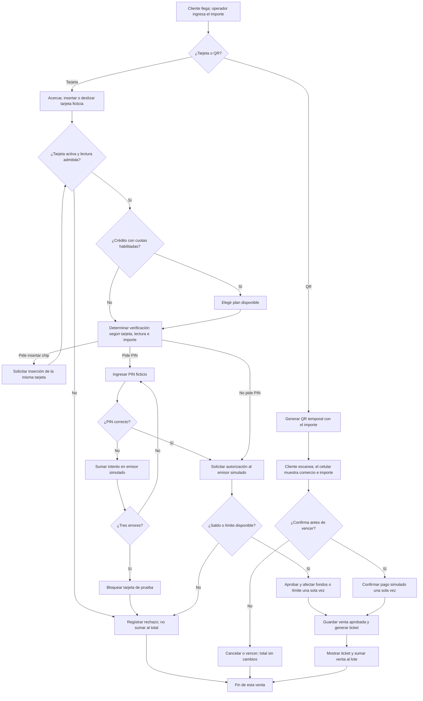

# Diagrama de procesos del terminal POS simulado

Este diagrama describe el **nuevo terminal de pagos propuesto**. Todavía no representa el funcionamiento de la aplicación de facturas que está en la raíz del repositorio. Los cobros, tarjetas, PIN y autorizaciones del diagrama son ficticios.

## Verlo en VS Code

Abrí este archivo `.md` y presioná **Ctrl+Shift+V** para abrir la vista previa de Markdown, o **Ctrl+K, V** para verla al lado del texto. VS Code renderiza los bloques `mermaid` en su vista previa integrada; no hace falta instalar una extensión. El diagrama se puede editar como texto y la vista previa reflejará los cambios. [Documentación oficial de VS Code](https://code.visualstudio.com/docs/languages/markdown#_mermaid-diagram-rendering).

## Venta

La verificación del titular (por ejemplo, PIN) y la autorización del importe son pasos distintos. Un PIN correcto puede ir seguido de un rechazo por falta de fondos. La regla de **tres errores** pertenece solo al emisor ficticio de esta simulación; no afirma una regla universal bancaria.

## Después de la venta

El operador puede consultar operaciones y reimprimir un ticket. Puede anular una venta aprobada mientras el lote esté abierto. Al terminar el turno, cierra el lote y consulta el total de **ventas aprobadas menos anulaciones**, desglosado por medio. El cierre no ocurre automáticamente después de cada cliente ni representa un depósito bancario.
