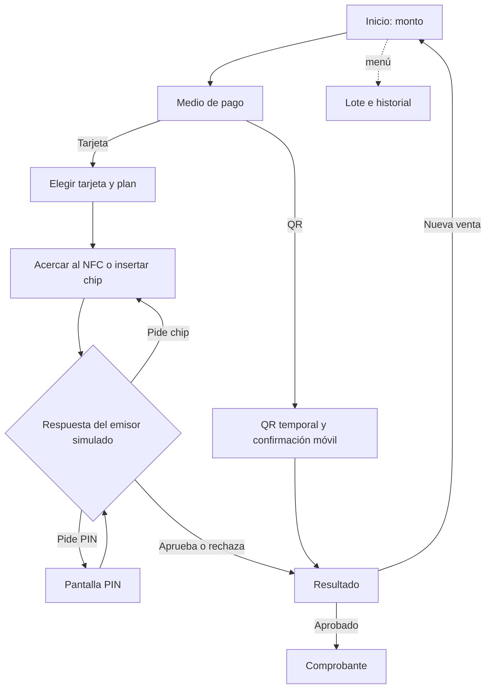

# Pantallas del terminal POS simulado

Todas las acciones de cobro aparecen en la pantalla del aparato. Las dos tarjetas ficticias permanecen a un lado como objetos que se arrastran; no hay un panel de cobro externo. El diseño es genérico: no reproduce el software de un modelo Dinelco identificado.

| Pantalla | Qué muestra | Acción principal |
|---|---|---|
| Inicio / Venta | Estado del lote, importe y teclado numérico | Ingresar monto y tocar **Cobrar** |
| Medio de pago | Importe confirmado, tarjeta o QR | Elegir un medio |
| Tarjeta | Tarjeta elegida, plan y zonas de lectura | Arrastrar débito/crédito al lector superior NFC o ranura inferior de chip |
| Lectura | Método detectado y mensaje del emisor ficticio | Esperar o presentar nuevamente el chip si se solicita |
| PIN | Cuatro indicadores enmascarados, teclado e intentos restantes | Confirmar el PIN ficticio |
| QR | Código temporal, importe, vencimiento y cancelación | Escanear y confirmar desde la página móvil de prueba |
| Procesando | Espera de respuesta | Esperar sin repetir el cobro |
| Resultado | Aprobación, rechazo o error y monto | Nueva venta o ver comprobante si fue aprobado |
| Comprobante | Ticket reconstruido desde la operación guardada | Imprimir o guardar |
| Lote | Estado, total de ventas y neto | Abrir o cerrar lote en esta simulación |
| Historial | Operaciones locales del simulador | Ver ticket o anular una venta del lote abierto |

El movimiento de la tarjeta y las transiciones visuales no autorizan pagos. El backend determina cuándo pedir PIN, aprobar, rechazar o emitir comprobante. El PIN se enmascara en pantalla y no se almacena en la base del POS.
